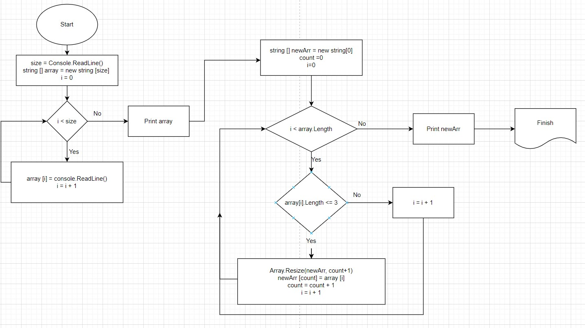

# Итоговая проверочная работа.
**Задача:** написать программу,  которая из имеющегося массива строк формирует массив из строк, длина которых меньше или равна 3 символам. Первоначальный массив можно ввести с клавиатуры, либо задать на старте выполнения алгоритма. 

## Решение.
1. Пользователь задает размер строкового массива.
2. Пользователь последовательно вводит элементы строкового массива в соответствии с заданным количеством.
3. После окончания ввода на экран выводится введенный пользователем массив.
4. Создается новый пустой массив.
5. Каждый элемент заданного массива проверяется на соответствие длине символов менее и равно 3. В случае наличия такого элемента, новый массив увеличивается на 1 элемент и в него записывается найденный элемент. Далее перебор элементов возобновляется, пока не будут проверены все заданные элементы.
6. Новый массив выаодится на экран.

## Блок-схема выполнения задачи.

